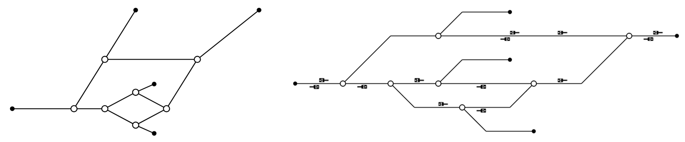
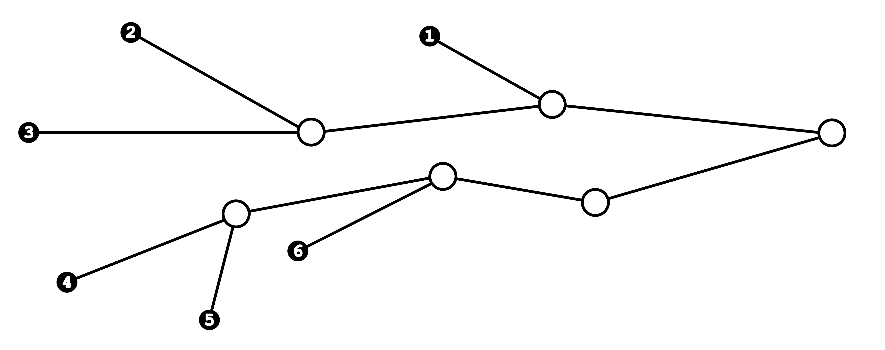

# Schematic-Converter

This small library allows an existing yaramo topology to be converted so that it corresponds to a schematic representation when visualized. <br>
The algorithm replaces the original GeoNodes with EuclideanGeoNodes that correspond to the positions of the switches and signals in the schematic representation. All intermediate_geo_nodes of the edges are removed and replaced by at most one breakpoint, which ensures that all edges bend at a consistent angle.



---

## Usage

*Convert an existing Yaramo Topology*
```python
from schematicconverter import convert

convert(
    topology=existing_topology,     # provide an existing yaramo topology
    scale_factor=4.5,               # set the zoom level of the node layout (default: 4.5)
    remove_non_ks_signals=True      # remove any signals that are no KS signals (default: True)
)
```

---

## Functionality

### Preprocessing the Topology

#### Building a Directed Graph

The Yaramo topology is used as the basis for constructing a `SchematicGraph`.  
In this graph:  
- `SchematicNode`s are extended versions of Yaramo-`Node`.  
- `SchematicEdge`s are extended versions of Yaramo-`Edge`.  

The graph is directed in order to avoid distortions when aligning switches in the schematic view.  
The direction of each edge is determined by the coordinates of its adjacent nodes:  
- If the x-coordinates differ, the edge points from left to right.  
- If the x-coordinates are the same, the y-coordinate decides the direction.  

After processing the Yaramo topology, additional properties are computed for each node.  
These properties are later required for generating the schematic representation.

<br>

#### Extending Yaramo `Node` and `Edge`

Each Yaramo-`Node` and Yaramo-`Edge` is represented by a `SchematicNode` or `SchematicEdge`.  
These provide additional functionality compared to the plain versions.

**`SchematicNode` extensions**
- `predecessors`: Direct incoming neighbors.  
- `successors`: Direct outgoing neighbors.  
- `reaching_nodes`: All nodes that can reach this node.  
- `reachable_nodes`: All nodes that can be reached from this node.  
- `height`: The longest path length (in edges) from this node to an end node.  

**`SchematicEdge` extensions**
- `signals_in`: Signals pointing from `target` (right) to `source` (left).  
- `signals_against`: Signals pointing from `source` (left) to `target` (right).  
- `intermediate_geo_node`: Allows to set a maximum of one `intermediate_geo_node` (breakpoint) on the edge.  

<br>

### Determining the Order of Start Nodes

Before the new positions of the nodes can be calculated, the ordering of the `start_nodes` (`SchematicNodes` without predecessors) along the y-axis must first be determined. This step is essential to avoid unintended edge crossings later in the schematic layout.  
It is not sufficient to simply use the original y-coordinates from the input topology, as the example below demonstrates:  




**Recomputing `reaching_nodes`**

To determine the intended order of the `start_nodes`, the `reaching_nodes` for each node are recomputed and stored in a dictionary.  
These recomputed `reaching_nodes` differ from the original ones in the graph, since their calculation excludes any edges that overlap with others.


**Minimal Cover**

Next, a *minimal cover* is computed.  
This is the smallest possible set of nodes such that every start node can reach at least one of the nodes in the *minimal_cover* set.  
The minimal cover is found using a brute-force algorithm, which is still efficient because of the previously stored `reaching_nodes`.


**Ordering via Depth-First Search**

A depth-first search is performed in reverse from each node in the minimal cover, considering only predecessors at each step. At every node, the predecessor with the lower slope (relative to the current node) is visited first.  
This approach ensures that the uppermost nodes are processed before any others. Nodes are then added to the sorted list of `start_nodes` in the correct order.


<br>

### Generating the Node Positions


To determine the positions of all nodes, multiple depth-first searches (DFS) are performed on the directed graph.

A DFS is started from each start node. During traversal, both `vertical_idx` and `horizontal_idx` (integers) are incremented step by step. For every `start_node`, the initial value of `horizontal_idx` is set to `0`. Only for the very first `start_node`, `vertical_idx` is also set to `0`.  
The newly assigned coordinates of each node are set to the current values of `horizontal_idx` and `vertical_idx` during the DFS.  

For each visited node, it is checked whether *all* of its predecessors have already been processed. If this is not the case, neither the node itself nor its successors are handled further. This guarantees that a node’s position is only assigned once its `vertical_idx` is greater than that of all its predecessors.

The algorithm aims to keep each track as horizontal as possible.  
- If a node has only one successor, its `vertical_idx` remains unchanged.  
- If a node has two successors, several rules decide which one bends upward or downward:  
  1. If one of the successors is part of a main track, that successor always continues horizontally (main tracks never bend).  
  2. If neither successor belongs to a main track, their `height` values are compared. The node with the greater height continues horizontally, since it is likely part of a longer track, making it more valuable to keep straight.

The algorithm is applied to every start node. In each case, `horizontal_idx` begins at `0`. The `vertical_idx` for a given start node is determined by the highest y-coordinate already assigned to previously visited nodes. Breakpoints defined during the algorithm are also taken into account.

After this, the algorithm is executed a second time. In this pass, the y-coordinates of the nodes remain fixed from the first run, so all logic involving `vertical_idx` is omitted.

Finally, adjustments are made to improve the schematic overview:  
- Start and end nodes belonging to a main track are shifted horizontally so that the main track extends across the entire width of the schematic overview.  
- Nodes that are not part of a main track are shifted to reduce unnecessarily long edges, since otherwise all start nodes would remain aligned at the far left edge of the schematic.

<br>

### Arrangement of Signals on the Edges

During the generation of node positions, the edges were already created long enough to accommodate all signals placed on them. Since the distances between nodes are integers, an edge of length *n* is divided into a discrete interval of length *n-1*.  
Using `scipy.optimize.linear_sum_assignment`, the optimal placement of signals within this interval is computed based on their distance to the source node. Each signal is then assigned to its corresponding position.  
This algorithm is applied to every edge, both for signals pointing in the direction of the start node and for signals pointing against it.
