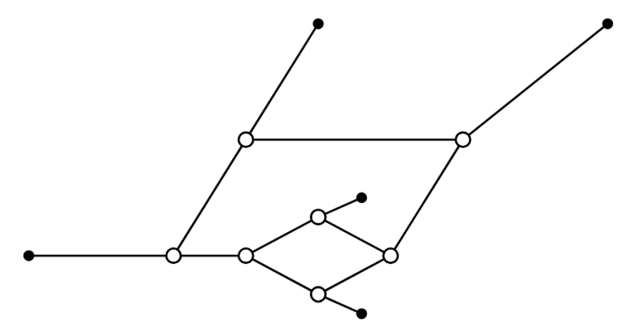
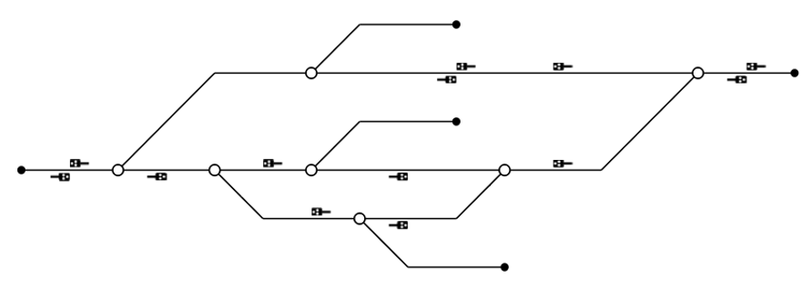

# Schematic-Converter

This small library allows an existing yaramo topology to be converted so that it corresponds to a schematic representation when visualized. <br>
The algorithm replaces the original GeoNodes with EuclideanGeoNodes that correspond to the positions of the switches and signals in the schematic representation. All intermediate_geo_nodes of the edges are removed and replaced by at most one breakpoint, which ensures that all edges bend at a consistent angle.

<p align="center">
  
  
</p>

## Usage

*Convert an existing Yaramo Topology*
```python
from schematicconverter import convert

convert(
    topology=existing_topology,     # provide an existing yaramo topology
    scale_factor=4.5,               # set the zoom level of the node layout (default: 4.5)
    remove_non_ks_signals=True      # remove any signals that are no KS signals (default: True)
)
```

## Functionality

### Preprocessing the Topology

#### Extending Yaramo ```Node``` and ```Edge```

XXX

#### Building a Directed Graph

XXX

### Finding the Correct Start Node Order

XXX

### Generating the Node Positions

XXX

### Arrangement of Signals on the Edges

XXX